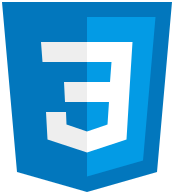

<h1>Hey, I'm Christoffer</h1>

I am a 21 year old student at NTNU Trondheim currently pursuing a master's degree in electronics engineering (year 3/5). On my GitHub you will find personal projects as well as  projects I have had for some of my university courses. 

<h2>Languages</h2>

<h2>Get in touch</h2>

<!---
I like web development, 

- 👀 I’m interested in ...
- 🌱 I’m currently learning ...
- 💞️ I’m looking to collaborate on ...
- 📫 How to reach me ...
--->

<!---
chrisskiberg/chrisskiberg is a ✨ special ✨ repository because its `README.md` (this file) appears on your GitHub profile.
You can click the Preview link to take a look at your changes.
--->
